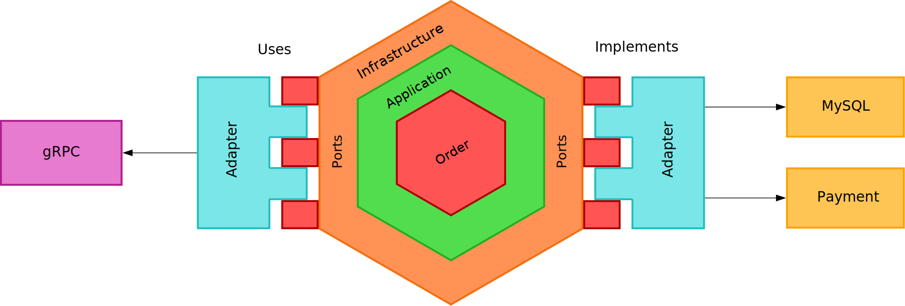
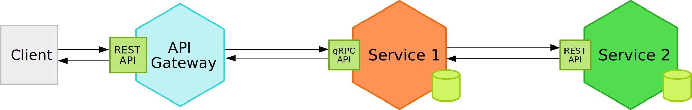
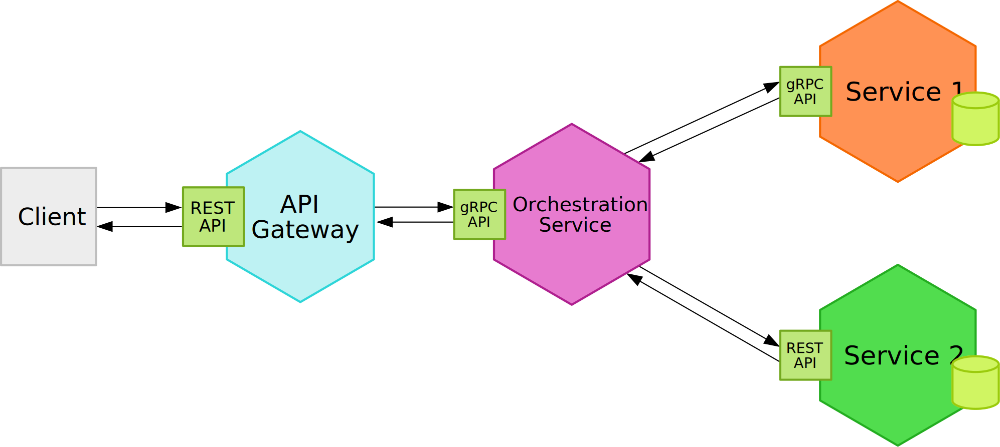
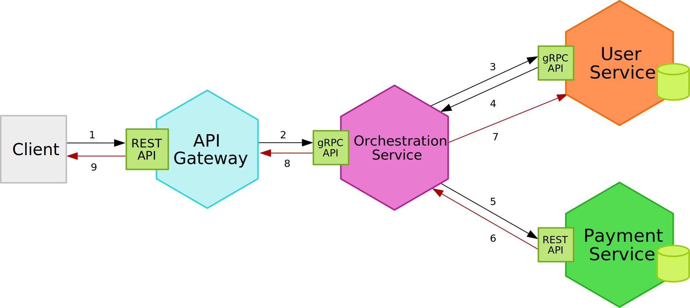
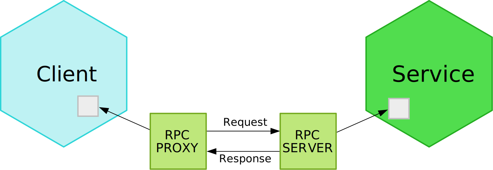
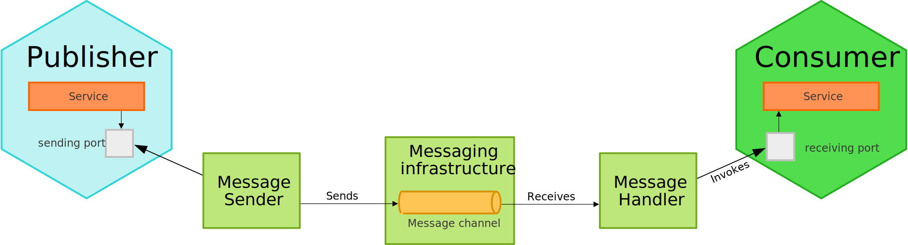
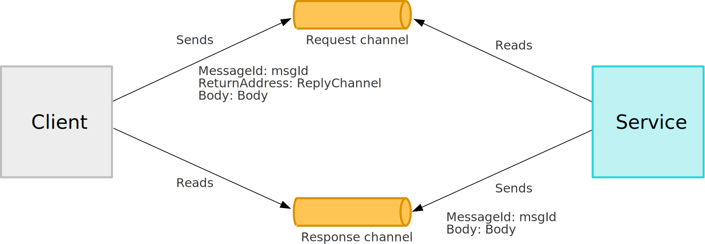
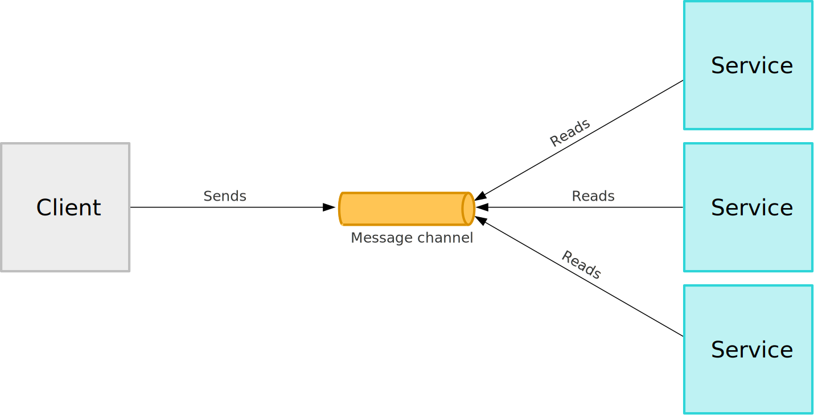

# Introduction

## Outline

- What are Microservices
- When to use microservices
- Inter-service Communication
- Modeling Microservices
- Data Management
- Service Communication

## Tools

- Git
- DDD
- Ports and Adapters
- Containerization (Docker, Podman)
- Orchestration (Kubernetes)
- Provisioning (Terraform, Ansible)
- CI/CD (Jenkins, CircleCI, Github Actions)
- Databases (SQL, NoSQL)
- Message Broker (Kafka, NATS, RabbitMQ)
- Observability (Prometheus, Grafana, Zipkin)

## What are Microservices


---


---


---


---


---



---



---



---



---

A microservice contains everything to make one feature of our application work.

This usually includes:

- Routing
- Middlewares
- Business Logic
- Database Access
- Subscribing to Messages/Events
- Publishing Messages/Events

## Benefits

- Fast compilation and build time
- Fast deployments and lower deployment size
- Custom deployment schedule for every service
- Custom deployment monitoring for critical services
- Independent and configurable automated testing
- Cross-language services
- Fine-grained APIs
- Horizontal Scaling
- Hardware flexibility
- Fault isolation
- Understandability of full code base
- Cost optimization
- Ease of refactoring

## Drawbacks

- Higher resource overhead
- Harder to debug
- Integration testing
- Consistency and transactions
- Divergence of library versions
- Observability
- Possible duplication of functionality
- Ownership and accountability

## When to use microservices

- Don't introduce microservices too early
- No size fits all

## Best practices

- API-first design
- Design for failure
- Embrace automation
- Invest in integration tests
- Keep backwards compatibility in mind

# Data Management

## Database per service

- Each service gets its own database (if it needs one)
- Services will never reach into another services database

## Benefits

- We want each service to run independently of other services (looseley coupled services)
- Database schema/structure might change unexpectedly
- Some services might function more efficiently with different types of DB's

## Drawbacks

- Business transactions that span multiple services are not straight forward to implement
- Implementing queries that join data that is now in multiple databases is challening
- Complexity of managing multiple different databases (SQL, NoSQL, ...)

## Problems

- Every Service same database
  - If database not available all serivces stop working
  - Scaling of the DB will be hard
- Service A directly accesses DB for Service B
  - If DB of Service B is down Service A will stop working (dependency between Service A and Service B)
  - If structure in Service B's database changes Service A will stop working
  ```{.json .numberLines}
  {
    "name": "Leander",
    "lastName": "Steiner"
  }

  {
    "firstName": "Leander",
    "lastName": "Steiner"
  }
  ```

# Inter-service Communication

## Interaction Styles

|              | one-to-one                                               | one-to-many                                    |
| ------------ | -------------------------------------------------------- | ---------------------------------------------- |
| Synchronous  | Request/response                                         | -                                              |
| Asynchronous | Asynchronous request/response <br> One-way notifications | Publish/subscribe <br> Publish/async responses |

## Synchronous Communication


## Data Formats

```{.go .numberLines}
var metadata = &model.Metadata{
  ID: "123",
  Title: "The Movie 2",
  Description: "Sequel of the legendary The Movie",
  Director: "Foo Bars",
}
```

```{.numberLines}
JSON size: 106B
XML size: 148B
Proto size: 63B
```

```{.numberLines}
BenchmarkSerializeToJSON-12  3308172  342 ns/op
BenchmarkSerializeToXML-12    480728 2519 ns/op
BenchmarkSerializeToProto-12 6596490  185 ns/op
```

## Popular Protocols

## HTTP / REST

- URL parameters
- Headers
- Request Body
- Response Body
- Status Codes
  - 2xx
  - 3xx
  - 4xx
  - 5xx

## Remote Procedure Calls (RPC)



## Apache Thrift

```{.numberLines}
struct Metadata {
  1: string id,
  2: string title,
  3: string description,
  4: string director
}

service MetadataService {
  Metadata get(1: string id)
}
```

## gRPC

- uses HTTP/2 as the transport protocol & Protocol Buffers as serialization format
- Provides ability to define RPC services and generate client and server code
- Extra features:
  - Authentication
  - Context propagation
  - Documentation generation
  - Server Streaming
  - Client Streaming
  - Bidirectional Streaming
- gRPC adoption is much higher than for Apache Thrift

---

```{.numberLines}
syntax = "proto3";

service MetadataService {
  rpc GetMetadata(GetMetadataRequest) returns (GetMetadataResponse);
  rpc PutMetadata(PutMetadataRequest) returns (PutMetadataResponse);
}

message GetMetadataRequest {
  string movie_id = 1;
}

message GetMetadataResponse {
  Metadata metadata = 1;
}

message Metadata {
  string id = 1;
  string title = 2;
  string description = 3;
  string director = 4;
}
```

## Benefits

- Easy to understand
- No need for more databases

## Drawbacks

- Introduces a dependency between two services
- If any inter-service request fails, the overall request fails
- The entire request is only as fast a the slowest request
- Can easily introduce webs of request
  - Nested synchronous requests are additive


## Asynchronous Communication

## Messaging



## Messages

- Document
- Command
- Event

## Asynchronous Request Response



## One-way Notifications


## Publish/Subscribe



## API Specification

- names of message channels
- message types exchanged over each channel
- message formats (JSON, XML, Protobuf)
- asynchronous operations
- published events

## Message Broker

- ActiveMQ
- RabbitMQ
- Apache Kafka
- Nats Jetstream
- AWS Kinesis
- AWS SQS

## Guarantees

- At-least-once
- At-most-once
- Exactly-once

- Send and forget
- Store and forward

## Models

- Point-to-Point
  - Message addressed to one recipient
- Publish-Subscribe
  - Message published into a topic

```java
MessageProducer messageProducer = ...;
String channel = ...;
String payload = ...;
messageProducer.send(destination, MessageBuilder.withPayload(payload).build())
```

```java
MessageConsumer messageConsumer;
messageConsumer.subscribe(subscriberId, Collections.singleton(destination), message -> { ... })
```

```java
DomainEventPublisher domainEventPublisher;

String accountId = ...;

DomainEvent domainEvent = new AccountDebited(...);

domainEventPublisher.publish("Account", accountId, Collections.singletonList(domainEvent));
```

```java
DomainEventHandlers domainEventHandlers = DomainEventHandlersBuilder
    .forAggregateType("Order")
    .onEvent(AccountDebited.class, domainEvent -> { ... })
    .build();

new DomainEventDispatcher("eventDispatcherId",domainEventHandlers,messageConsumer);
```

## Apache Kafka

## Message ordering


## Benefits

- No dependencies on other services
- Service will be extremely fast
- Overload protection/Message buffering
- Reliability due to store and forward
- Non-blocking

## Drawbacks

- Data duplication
- Harder to understand
- Sequential messages
- Potential performance bottleneck
- Potential single point of failure
- Additional operational complexity

# Minimal DDD and Architecture

## Ingredients of effective modeling

1. Binding the model and the implementation
2. Cultivating a language based on the model
3. Developing a knowledge-rich model
4. Distilling the model
5. Brainstorming and experimenting

## Domains

- an area of expertise
- the area in which a software operates
- what an organization does and the world it does it in
- the knowledge space around the problems a software is designed to solve
- software developers have expertise in the domain of software development
- business problems cannot be solved with solution that exclusively belon to technological domains

## Subdomains

- distinguishable knowledge areas that are part of a larger compound
- core domain
  - area most relevant to the problems a software aims to solve
- supporting subdomain
  - combination of generic knowledge and problem-specific aspects
- generic subdomain
  - universal knowledge that is not specific to the main problem

## Definition of terms

- Domain
  - Knowledge area around a problem
- Domain Model
  - Structured abstraction of Domain knowledge
- Domain Model implementation
  - Software solution based on a Domain Model

## Bounded Contexts

- explicit boundary in whithin which a Domain Model exists
- intention to unify a model within certain boundaries

## Software Architecture

- **Domain**: Implementation of the Domain Model
- **Infrastructure**: Technical functionality with optional external dependencies
- **Application**: Use case execution, management of transaction and security
- **UI**: Interaction with the software

## Entities

```go
type Person struct {
  ID   uuid.UUID
  Name string
  Age  int
}

type Item struct {
  ID          uuid.UUID
  Name        string
  Description string
}
```

```java
public class Person {

  private final PersonId personId;
  private final EventLog changeLog;

  private PersonName name;
  private LocalDate birthDate;
  private StreetAddress address;
  private EmailAddress email;
  private PhoneNumber phoneNumber;

  public Person(PersonId personId, PersonName name) {
    this.presonId = Objects.requireNonNull(personId);
    this.changeLog = new EventLog();
    changeName(name, "initial name");
  }

  public void changeName(PersonName name, String reason) {
    Objects.requireNonNull(name);
    this.name = name;
    this.changeLog.register(new NameChangeEvent(name), reason);
  }

  public Stream<PersonName> getNameHistory() {
    return this.changeLog.eventsOfType(NameChangeEvent.class).map(NameChangeEvent::getNewName);
  }
}
```

## Value Objects

```go
type Transaction struct {
  amount    int
  from      uuid.UUID
  to        uuid.UUID
  createdAt time.Time
}
```

## Aggregates

```go
type Customer struct {
  person       *entity.Person
  products     []*entity.Item
  transactions []valueobjects.Transactions
}
```

## Factories

```go
func NewCustomer(name string) (Customer, error) {
  if name == "" {
    return Customer{}, ErrInvalidName
  }

  person := &entity.Person{
    Name: name,
    ID:   uuid.New(),
  }

  return Customer{
    person:       person,
    products:     make([]*entity.Item, 0),
    transactions: make([]valueobjects.Transaction, 0)
  }, nil
}
```

## Services

### Application

### Domain

### Infrastructure

## Domain Events

## Modules

## Repositories

```go
type CustomerRepository interface {
  Get(uuid.UUID) (aggregate.Customer, error)
  Add(aggregate.Customer) error
  Update(aggregate.Customer) error
}
```

```go
type MemoryRepository struct {
  sync.RWMutex
  customers map[uuid.UUID]aggregate.Customer
}

func New() *MemoryRepository {
  return &MemoryRepository{
    customers: make(map[uuid.UUID]aggregate.Customer),
  }
}

func (mr *MemoryRepository) Get(uuid.UUID) (aggregate.Customer, error) {
	return aggregate.Customer{}, nil
}

func (mr *MemoryRepository) Add(aggregate.Customer) error {
	return nil
}

func (mr *MemoryRepository) Update(aggregate.Customer) error {
	return nil
}
```

# Containers & Orchestration
