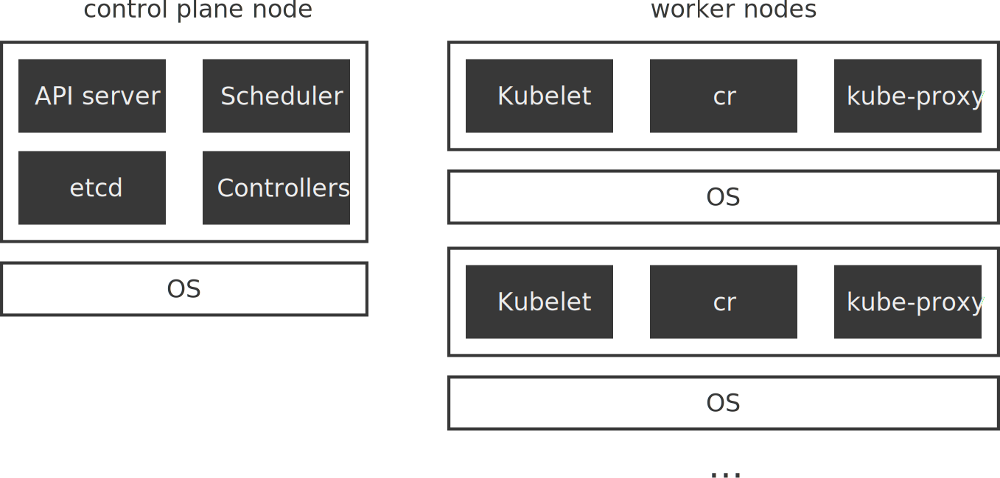
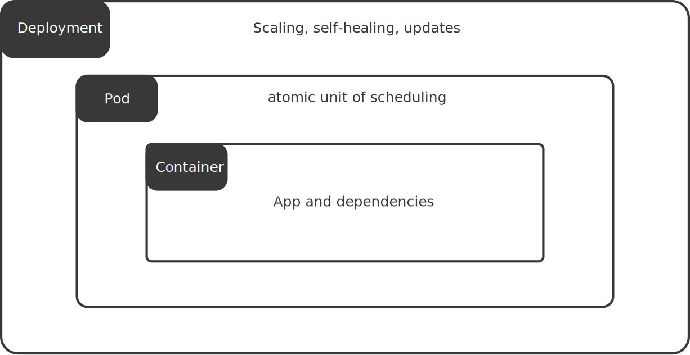
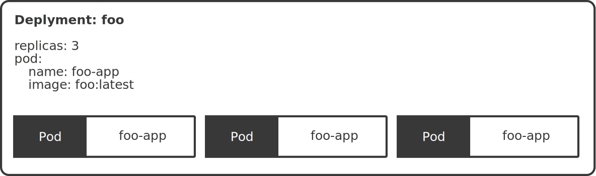
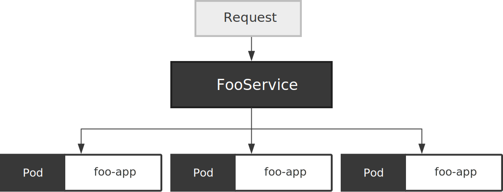

# Minimal DDD and Architecture

## Ingredients of effective modeling

1. Binding the model and the implementation
2. Cultivating a language based on the model
3. Developing a knowledge-rich model
4. Distilling the model
5. Brainstorming and experimenting

## Domains

- an area of expertise
- the area in which a software operates
- what an organization does and the world it does it in
- the knowledge space around the problems a software is designed to solve
- software developers have expertise in the domain of software development
- business problems cannot be solved with solution that exclusively belon to technological domains

## Subdomains

- distinguishable knowledge areas that are part of a larger compound
- core domain
  - area most relevant to the problems a software aims to solve
- supporting subdomain
  - combination of generic knowledge and problem-specific aspects
- generic subdomain
  - universal knowledge that is not specific to the main problem

## Definition of terms

- Domain
  - Knowledge area around a problem
- Domain Model
  - Structured abstraction of Domain knowledge
- Domain Model implementation
  - Software solution based on a Domain Model

## Bounded Contexts

- explicit boundary in whithin which a Domain Model exists
- intention to unify a model within certain boundaries

## Software Architecture

- **Domain**: Implementation of the Domain Model
- **Infrastructure**: Technical functionality with optional external dependencies
- **Application**: Use case execution, management of transaction and security
- **UI**: Interaction with the software

---


## Entities

```java
public class Person {

  private final PersonId personId;

  private PersonName name;
  private LocalDate birthDate;
  private StreetAddress address;
  private EmailAddress email;
  private PhoneNumber phoneNumber;

  ...
}
```

## Value Objects

```{.java. .numberLines}
public class MonetaryAmount {
  private final BigDecimal amount;
  private final Currency currency;

  ...
}
```

## Aggregates

```{.java .numberLines}
public class CheckingAccount {
  private Person accountHolder;
  private Collection<Transaction> transactions;
  private MonetaryAmount currentBalance;

  ...
}
```

## Repositories

```{.java .numberLines}
public interface UserRepository {
    Iterable<User> findAll();
    Optional<User> findById(int id);
    boolean exists(int id);
    User save(User user);
    User delete(int id);
}
```

---

```{.java .numberLines}
@Repository
public class InMemoryUserRepository implements UserRepository {
    private static final Map<Integer, User> users = new ConcurrentHashMap<>();

    @Override
    public Iterable<User> findAll() {
        return users.values();
    }

    @Override
    public Optional<User> findById(int id) {
        return exists(id) ? Optional.of(users.get(id)) : Optional.empty();
    }

    @Override
    public boolean exists(int id) {
        return users.get(id) != null;
    }

    @Override
    public User save(User user) {
        users.put(user.id(), user);
        return user;
    }

    @Override
    public User delete(int id) {
        return users.remove(id);
    }
}

```

# Introduction

## Tools

- Git
- DDD
- Ports and Adapters
- Containerization (Docker, Podman)
- Orchestration (Kubernetes)
- Provisioning (Terraform, Ansible)
- CI/CD (Jenkins, CircleCI, Github Actions)
- Databases (SQL, NoSQL)
- Message Broker (Kafka, NATS, RabbitMQ)
- Observability (Prometheus, Grafana, Zipkin)

## What are Microservices


---


---

A microservice contains everything to make one feature of our application work.

This usually includes:

- Routing
- Middlewares
- Business Logic
- Database Access
- Subscribing to Messages/Events
- Publishing Messages/Events

---


---


---


## Benefits

- Fast compilation and build time
- Fast deployments and lower deployment size
- Custom deployment schedule for every service
- Custom deployment monitoring for critical services
- Independent and configurable automated testing
- Cross-language services
- Fine-grained APIs
- Horizontal Scaling
- Hardware flexibility
- Fault isolation
- Understandability of full code base
- Cost optimization
- Ease of refactoring

## Drawbacks

- Higher resource overhead
- Harder to debug
- Integration testing
- Consistency and transactions
- Divergence of library versions
- Observability
- Possible duplication of functionality
- Ownership and accountability

## When to use microservices

- Don't introduce microservices too early
- No size fits all

## Best practices

- API-first design
- Design for failure
- Embrace automation
- Invest in integration tests
- Keep backwards compatibility in mind

# Data Management

## Database per service

- Each service gets its own database (if it needs one)
- Services will never reach into another services database
- Number of database clusters should not explode

## Benefits

- We want each service to run independently of other services (looseley coupled services)
- Database schema/structure might change unexpectedly
- Some services might function more efficiently with different types of DB's

## Drawbacks

- Business transactions that span multiple services are not straight forward to implement
- Implementing queries that join data that is now in multiple databases is challening
- Complexity of managing multiple different databases (SQL, NoSQL, ...)

## Problems

- Every Service same database
  - If database not available all serivces stop working
  - Scaling of the DB will be hard
- Service A directly accesses DB for Service B
  - If DB of Service B is down Service A will stop working (dependency between Service A and Service B)
  - If structure in Service B's database changes Service A will stop working

## Event Sourcing

- in relational databases we store state
- in even sourcing we store facts
- facts are replayed for current state
- get and save snapshots

```{.json .numberLines}
{
  "id": "23d2076f-41bd-4cdb-875e-2b0812a27524",
  "type": "VideoPublished",
  "metadata": {
    "traceId": "ddecf8e8-de5d-4989-9cf3-549c303ac939",
    "userId": "bb6a04b0-cb74-4981-b73d-24b844ca334f"
  },
  "data": {
    "ownerId": "bb6a04b0-cb74-4981-b73d-24b844ca334f",
    "sourceUri": "https://sourceurl.com/",
    "videoId": "9bfb5f98-36f4-44a2-8251-ab06e0d6d919"
  }
}
```

## Projections

```{.js .numberLines}
function priceUp(state, event) {
  state.increasePrice(event.amount);
}

function priceDown(state, event) {
  state.decreasePrice(event.amount);
}
```

## Event Store

- store new events
- notify event subscribers
- get N events after event X

```{.js .numberLines}
save(x)
getEventsAfter(x, eventTypes)
```

[Message DB](https://github.com/message-db/message-db)

---

```sql
CREATE TABLE IF NOT EXISTS message_store.messages (
  id UUID NOT NULL DEFAULT gen_random_uuid(),
  stream_name text NOT NULL,
  type text NOT NULL,
  position bigint NOT NULL,
  global_position bigserial NOT NULL,
  data jsonb,
  metadata jsonb,
  time TIMESTAMP WITHOUT TIME ZONE DEFAULT (now() AT TIME ZONE 'utc') NOT NULL
);

ALTER TABLE
  message_store.messages
ADD PRIMARY KEY (global_position) NOT DEFERRABLE INITIALLY IMMEDIATE;
```

[Eventide-Project](https://eventide-project.org/)

## Command Query Responsibility Segregation (CQRS)

## Data Aggregation

---


---


# Inter-service Communication

## Interaction Styles

|              | one-to-one                                               | one-to-many                                    |
| ------------ | -------------------------------------------------------- | ---------------------------------------------- |
| Synchronous  | Request/response                                         | -                                              |
| Asynchronous | Asynchronous request/response <br> One-way notifications | Publish/subscribe <br> Publish/async responses |

## Synchronous Communication


## Data Formats

```{.go .numberLines}
var metadata = &model.Metadata{
  ID: "123",
  Title: "The Movie 2",
  Description: "Sequel of the legendary The Movie",
  Director: "Foo Bars",
}
```

```{.numberLines}
JSON size: 106B
XML size: 148B
Proto size: 63B
```

```{.numberLines}
BenchmarkSerializeToJSON-12  3308172  342 ns/op
BenchmarkSerializeToXML-12    480728 2519 ns/op
BenchmarkSerializeToProto-12 6596490  185 ns/op
```

## Popular Protocols

## HTTP / REST

- URL parameters
- Headers
- Request Body
- Response Body
- Status Codes
  - 2xx
  - 3xx
  - 4xx
  - 5xx

## Remote Procedure Calls (RPC)


## Apache Thrift

```{.numberLines}
struct Metadata {
  1: string id,
  2: string title,
  3: string description,
  4: string director
}

service MetadataService {
  Metadata get(1: string id)
}
```

## gRPC

- uses HTTP/2 as the transport protocol & Protocol Buffers as serialization format
- Provides ability to define RPC services and generate client and server code
- Extra features:
  - Authentication
  - Context propagation
  - Documentation generation
  - Server Streaming
  - Client Streaming
  - Bidirectional Streaming
- gRPC adoption is much higher than for Apache Thrift

---

```{.numberLines}
syntax = "proto3";

service MetadataService {
  rpc GetMetadata(GetMetadataRequest) returns (GetMetadataResponse);
  rpc PutMetadata(PutMetadataRequest) returns (PutMetadataResponse);
}

message GetMetadataRequest {
  string movie_id = 1;
}

message GetMetadataResponse {
  Metadata metadata = 1;
}

message Metadata {
  string id = 1;
  string title = 2;
  string description = 3;
  string director = 4;
}
```

## Benefits

- Easy to understand
- No need for more databases

## Drawbacks

- Introduces a dependency between two services
- If any inter-service request fails, the overall request fails
- The entire request is only as fast a the slowest request
- Can easily introduce webs of request
  - Nested synchronous requests are additive


## Asynchronous Communication

## Messaging


## Messages

- Document
- Command
- Event

---

```{.json .numberLines}
{
  "id": "928a73ca-2925-42c9-974a-467cd96e0a44",
  "type": "Register",
  "data": {
    "userId": "46aa6e66-adf9-40d0-bfe0-ae8ed5b70892",
    "email": "user@example.com",
    "passwordHash":"$2b$10$IrxFcWAxwRQGcNbK5Zr03.aLvgFGSUSdeUGw86ONXoz3Nm.PUlycS"
  }
}
```

---

```{.json .numberLines}
{
  "id": "10e23852-2725-4789-a4d2-4e0630b3a55d",
  "type": "Registered",
  "data": {
    "userId": "46aa6e66-adf9-40d0-bfe0-ae8ed5b70892",
    "email": "user@example.com",
    "passwordHash": "$2b$10$IrxFcWAxwRQGcNbK5Zr03.aLvgFGSUSdeUGw86ONXoz3Nm.PUlycS"
  }
}
```

```{.json .numberLines}
{
  "id": "ea0835d6-a073-4a25-aca9-db75c4c153f4",
  "type": "RegistrationRejected",
  "data": {
    "userId": "46aa6e66-adf9-40d0-bfe0-ae8ed5b70892",
    "email": "not an email",
    "passwordHash": "$2b$10$IrxFcWAxwRQGcNbK5Zr03.aLvgFGSUSdeUGw86ONXoz3Nm.PUlycS",
    "reason": "email was not valid"
  }
}
```

## Asynchronous Request Response


## One-way Notifications


## Publish/Subscribe


## API Specification

- names of message channels
- message types exchanged over each channel
- message formats (JSON, XML, Protobuf)
- asynchronous operations
- published events

## Message Broker

- ActiveMQ
- RabbitMQ
- Apache Kafka
- Nats Jetstream
- AWS Kinesis
- AWS SQS

## Guarantees

- At-least-once
- At-most-once
- Exactly-once

- Send and forget
- Store and forward

## Models

- Point-to-Point
  - Message addressed to one recipient
- Publish-Subscribe
  - Message published into a topic

```java
MessageProducer messageProducer = ...;
String channel = ...;
String payload = ...;
messageProducer.send(destination, MessageBuilder.withPayload(payload).build())
```

```java
MessageConsumer messageConsumer;
messageConsumer.subscribe(subscriberId, Collections.singleton(destination), message -> { ... })
```

```java
DomainEventPublisher domainEventPublisher;

String accountId = ...;

DomainEvent domainEvent = new AccountDebited(...);

domainEventPublisher.publish("Account", accountId, Collections.singletonList(domainEvent));
```

```java
DomainEventHandlers domainEventHandlers = DomainEventHandlersBuilder
    .forAggregateType("Order")
    .onEvent(AccountDebited.class, domainEvent -> { ... })
    .build();

new DomainEventDispatcher("eventDispatcherId",domainEventHandlers,messageConsumer);
```

## Benefits

- No dependencies on other services
- Service will be extremely fast
- Overload protection/Message buffering
- Reliability due to store and forward
- Non-blocking

## Drawbacks

- Data duplication
- Harder to understand
- Sequential messages
- Potential performance bottleneck
- Potential single point of failure
- Additional operational complexity

## Sagas


# Containers & Orchestration

## Kubernetes



---



---



---



# Stability Patterns

## Circuit Breaker

---

```{.go .numberLines}
type Circuit func(context.Context) (string, error)

func Breaker(circuite Circuit, failureThreshold uint) Circuit {
  var consecutiveFailures int = 0
  var lastAttempt = time.Now()
  var m sync.RWMutex

  return func(ctx context.Context) (string, error) {
    m.RLock()
    d := consecutiveFailure - int(failureThreshold)
    if d >= 0 {
      shouldRetryAt := lastAttempt.Add(time.Seconds * 2 << d)
      if !time.Now().After(shouldRetryAt) {
        m.RUnlock()
        return "", errors.New("service unreachable")
      }
    }
    m.RUnlock()
    response, err := circuit(ctx)
    m.Lock()
    defer m.Unlock()
    lastAttempt = time.Now()
    if err != nil {
      consecutiveFailures++
      return respone, err
    }
    consecutiveFailures = 0
    return response, nil
  }
}
```
