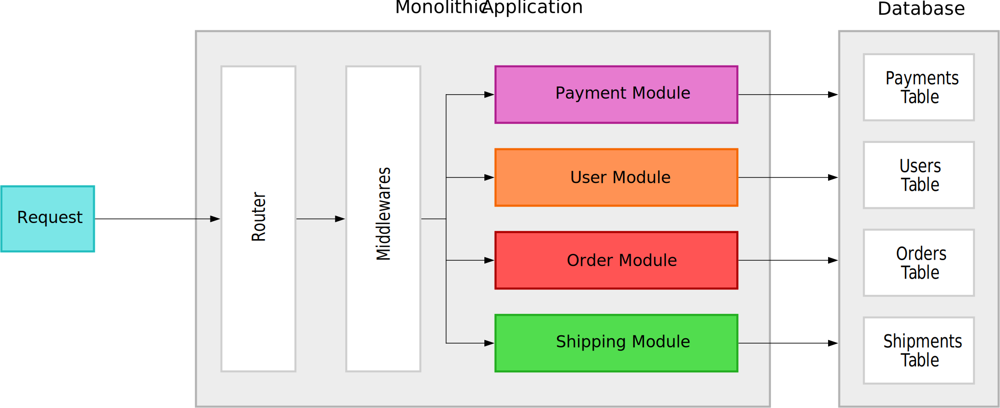

# Introduction

## Outline

- What are Microservices
- Inter-service Communication
- Modeling Microservices
- Data Management
- Service Communication

## Tools

- Git
- Containerization (Docker, Podman)
- Orchestration (Kubernetes)
- Provisioning (Terraform, Ansible)
- CI/CD (Jenkins, CircleCI, Github Actions)
- Databases (SQL, NoSQL)
- Message/Event Broker (Kafka, NATS, RabbitMQ)
- Monitoring & Tracing (Prometheus, Grafana, Zipkin)

## What are Microservices


---


---


---



---


---

A microservice contains everything to make one feature of our application work.

This usually includes:

- Routing
- Middlewares
- Business Logic
- Database Access
- Subscribing to Messages/Events
- Publishing Messages/Events

## Pros

- Fast compilation and build time
- Fast deployments and lower deployment size
- Custom deployment schedule for every service
- Custom deployment monitoring for critical services
- Independent and configurable automated testing
- Cross-language services
- Fine-grained APIs
- Horizontal Scaling
- Hardware flexibility
- Fault isolation
- Understandability of full code base
- Cost optimization
- Ease of refactoring

## Cons

- Higher resource overhead
- Harder to debug
- Integration testing
- Consistency and transactions
- Divergence of library versions
- Observability
- Possible duplication of functionality
- Ownership and accountability

## When to use microservices

- Don't introduce microservices too early
- No size fits all

## Best practices

- Design for failure
- Embrace automation
- Invest in integration tests
- Keep backwards compatibility in mind

# Data Management

## Database per service

- Each service gets its own database (if it needs one)
- Services will never reach into another services database

## Pros

- We want each service to run independently of other services (looseley coupled services)
- Database schema/structure might change unexpectedly
- Some services might function more efficiently with different types of DB's

## Cons

- Business transactions that span multiple services are not straight forward to implement
- Implementing queries that join data that is now in multiple databases is challening
- Complexity of managing multiple different databases (SQL, NoSQL, ...)

## Problems

- Every Service same database
  - If database not available all serivces stop working
  - Scaling of the DB will be hard
- Service A directly accesses DB for Service B
  - If DB of Service B is down Service A will stop working (dependency between Service A and Service B)
  - If structure in Service B's database changes Service A will stop working
  ```{.json .numberLines}
  {
    "name": "Leander",
    "lastName": "Steiner"
  }

  {
    "firstName": "Leander",
    "lastName": "Steiner"
  }
  ```

# Inter-service Communication

## Synchronous Communication


## Data Formats

```{.go .numberLines}
var metadata = &model.Metadata{
  ID: "123",
  Title: "The Movie 2",
  Description: "Sequel of the legendary The Movie",
  Director: "Foo Bars",
}
```

```{.numberLines}
JSON size: 106B
XML size: 148B
Proto size: 63B
```

```{.numberLines}
BenchmarkSerializeToJSON-12  3308172  342 ns/op
BenchmarkSerializeToXML-12    480728 2519 ns/op
BenchmarkSerializeToProto-12 6596490  185 ns/op
```

## Popular Protocols

## HTTP

- URL parameters
- Headers
- Request Body
- Response Body
- Status Codes
  - 2xx
  - 3xx
  - 4xx
  - 5xx

## Apache Thrift

```{.numberLines}
struct Metadata {
  1: string id,
  2: string title,
  3: string description,
  4: string director
}

service MetadataService {
  Metadata get(1: string id)
}
```

## gRPC

- uses HTTP/2 as the transport protocol & Protocol Buffers as serialization format
- Provides ability to define RPC services and generate client and server code
- Extra features:
  - Authentication
  - Context propagation
  - Documentation generation
  - Server Streaming
  - Client Streaming
  - Bidirectional Streaming
- gRPC adoption is much higher than for Apache Thrift

---

```{.numberLines}
syntax = "proto3";
option go_package = "/gen";

service MetadataService {
  rpc GetMetadata(GetMetadataRequest) returns (GetMetadataResponse);
  rpc PutMetadata(PutMetadataRequest) returns (PutMetadataResponse);
}

message GetMetadataRequest {
  string movie_id = 1;
}

message GetMetadataResponse {
  Metadata metadata = 1;
}

message Metadata {
  string id = 1;
  string title = 2;
  string description = 3;
  string director = 4;
}
```

## Pros

- Easy to understand
- No need for more databases

## Cons

- Introduces a dependency between two services
- If any inter-service request fails, the overall request fails
- The entire request is only as fast a the slowest request
- Can easily introduce webs of request
  - Nested synchronous requests are additive


## Asynchronous Communication

## Message Broker

- Message delivery
- Message transformation
- Message aggregation
- Message routing

- Lossy
- Lossless

## Guarantees

- At-least-once
- Exactly-once
- At-most-once

## Publish-Subscribe model

## Apache Kafka

## Pros

- No dependencies on other services
- Service will be extremely fast

## Cons

- Data duplication
- Harder to understand

## Slide with sources 2

```{.java .numberLines}
public record Thing(long id, String name) {
    public String getNameAndId() {
        return id + name;
    }
}
```
