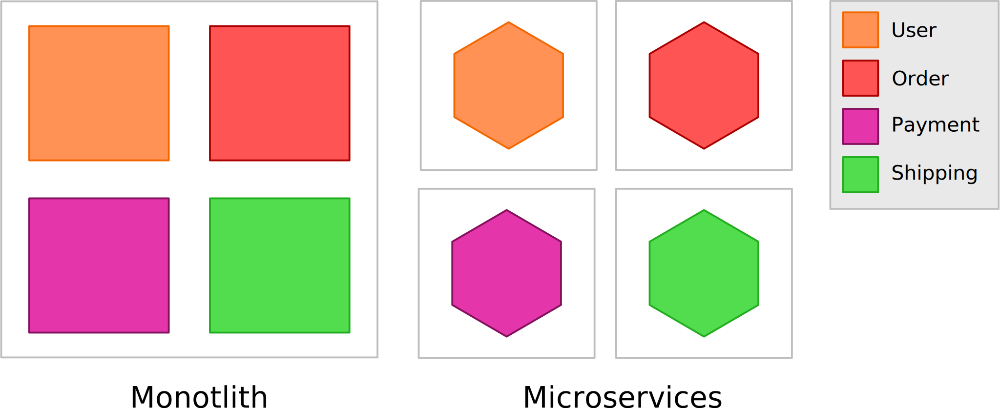
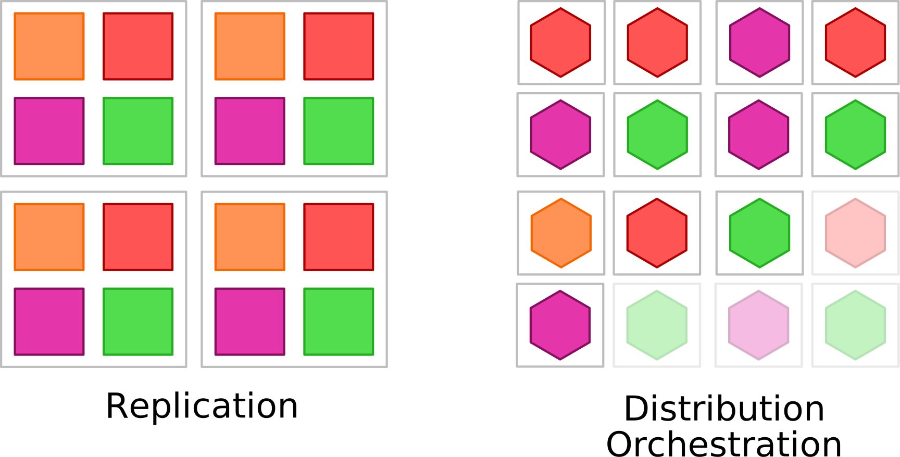

# Introduction

---

## Outline

- What are Microservices
- When to use Microservices
- Modeling Microservices
- Data Managements
- Service Communication

---

## Tools

- Git
- Containerization (Docker, Podman)
- Orchestration (Kubernetes)
- Provisioning (Terraform, Ansible)
- CI/CD (Jenkins, CircleCI, Github Actions)
- Databases (SQL, NoSQL)
- Message/Event Broker (Kafka, NATS, RabbitMQ)
- Monitoring & Tracing (Prometheus, Grafana, Zipkin)

---

# What are Microservices

---

## Microservice vs Monolith



---

## Scaling



---

# Test 3

## Test4


---

# Slide with sources 2

```{.java .numberLines}
public record Thing(long id, String name) {
    public String getNameAndId() {
        return id + name;
    }
}
```
